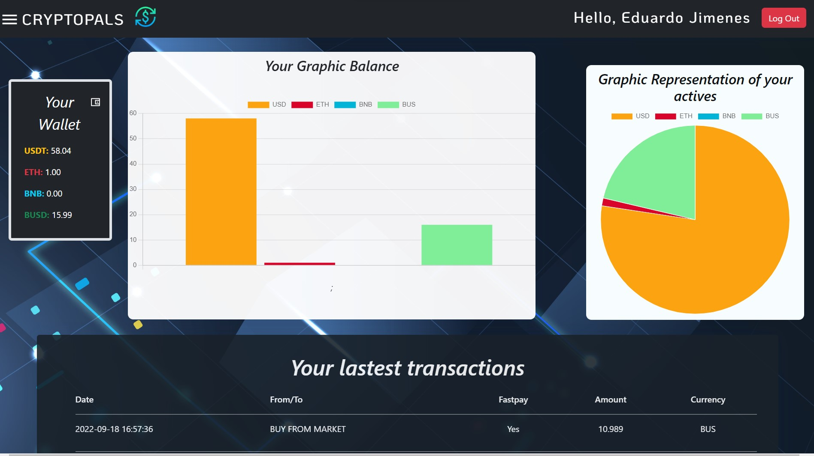

# Cryptopals Frontend WebPage

This is one of the most interesting projects that I’ve done and that I’m proud of it. It’s about a completely functional Crypto Wallet that I called *"Cryptopals"*. 
In this project I really learned about teamwork with my friend Jose Salazar. Even though, it wasn’t easy to finish this amazing project due to the limited time 
that we had (less than two months), I really enjoyed the experience using the BINANCE API, and I have to say that I improved my skills as a Frontend Developer =.

### Constructed with the following technologies
- JavaScript  
- NodeJS 
- Netlify 
- ReactJS 
- ViteJS 
---
### Dependencies
- [Popperjs](https://popper.js.org/)
- [Axios](https://www.npmjs.com/package/axios)
- [bootstrap](https://getbootstrap.com/)
- [Netlify CLI](https://docs.netlify.com/cli/get-started/)
- [Chartjs](https://www.chartjs.org/)
- [React Hot Toast](https://react-hot-toast.com/)
- [React Icons](https://react-icons.github.io/react-icons/)
- [React Router DOM](https://reactrouter.com/en/main)
- [Yup](https://www.npmjs.com/package/yup)

### How can I make a deposit to the account

1.  When the user is registered and has confirmed the link in his/her email inbox, she/he must make a deposit to an email that is on the page with the BINANCE platform.
2.  The user must enter the data of the deposit in the Load Acount Form.
3.  When The system valids the data, there you have!! Your real money in Cryptopals.

### Screenshoots
<h4>Home</h4>

<h4>Dashboard</h4>

<h4>Buy Cryptos</h4>

<h4>Transfer (with MSG verification)</h4>

<h4>Load Account</h4>

  
 # Functions
- [x] Register and Sign in pages
- [x] Buy/Sell Cryptos in Real Time  
- [x] Load Account with REAL MONEY
- [x] Transfer money with a message verification
- [x] Show a dashboard page the user's balance

### Visit the Backend 👀

- [Backend](https://github.com/Andresc06/cryptopals-backend)
